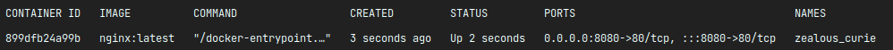
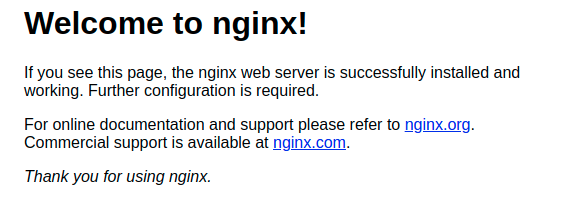
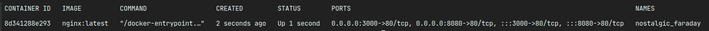

# How to expose your container port?

When you look up on your containers list you will see that each container has his own port.

For our nginx container it is **80**. But what does it mean?

If container has port **80** it means that port **80** will receive request for our container. Simple? But this port is
isolated into docker, so we need to expose an external port to which we will send our request.

Let's expose an external port for our container. For example **8080**.

``docker run -d -p 8080:80 nginx:latest``

As you can see now our nginx container has **external port 8080** which will receive our requests and send them to
**internal port 80**.

Now let's try to get into **localhost:8080**

Congrats! Nginx is running.

Ok, but that is not the end. We can also expose multiple ports for our container.

Let's try.

``docker run -d -p 8080:80 -p 3000:80 nginx:latest``

And now we have access to our nginx container from two addresses: **localhost:8080** and **localhost:3000**.

## NOTE
Without exposing port containers will be available only to each other inside your docker machine.