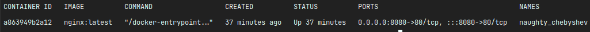
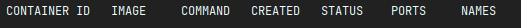

# How to remove container?

Let's see our running container.

``docker ps -a`` - **-a** to display all containers (not only running)

And now let's try to remove our container.

``docker rm [container_id]``

And then we will see this message: _Error response from daemon: You cannot remove a running container
a863949b2a12a09275b93a2f2a04f135008342600f26d498a65a1e215d2df063. Stop the container before attempting removal or force
remove_

So we need to stop the container before we will remove it.

``docker stop [container_id / container_name]``

And now let's try again. Docker will display for us the container id and when we will run ``docker ps -a`` we won't see
the container.

## Note

Add flag **-f** to ``docker rm`` and you will be able to remove also running container.