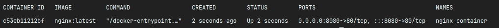

# How to name your container?

Until now, you have used the random name or container id to operate on your container, but this may be not comfortable
enough. So maybe you want to give a specific name for your container?

Let's try.

``docker run -d -p 8080:80 --name nginx_container nginx:latest`` - as far as you can see we add option **--name** to the
run command.

Let's see how it looks now.

``docker ps``

