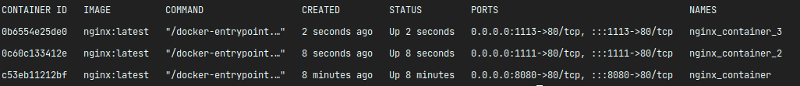
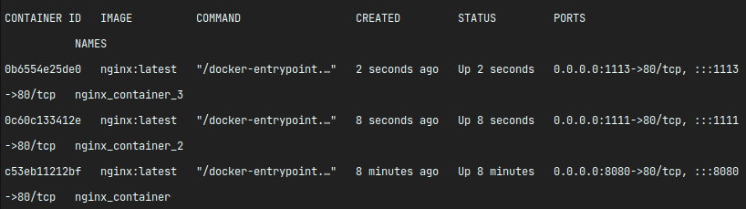
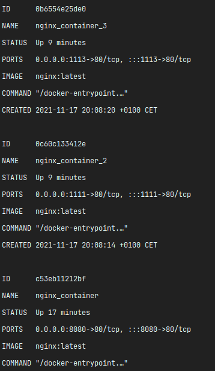

# How to format your containers list?

Let's run a few containers.

container 1: ``docker run -d -p 8080:80 --name nginx_container nginx:latest``

container 2: ``docker run -d -p 1111:80 --name nginx_container_two nginx:latest``

container 3: ``docker run -d -p 1113:80 --name nginx_container_three nginx:latest``

``docker ps``

Ok. Now it is readable, but let's resize our console.

No longer so pretty, uh?

So let's try to format our result. We will use **--format=** for our **docker ps**

``docker ps --format="ID\t{{.ID}}\nNAME\t{{.Names}}\nSTATUS\t{{.Status}}\nPORTS\t{{.Ports}}\nIMAGE\t{{.Image}}\nCOMMAND\t{{.Command}}\nCREATED\t{{.CreatedAt}}\n"``

Voilà. Or list is now much prettier.

But what have we done?

``--format="ID\t{{.ID}}\nNAME\t{{.Names}}\nSTATUS\t{{.Status}}\nPORTS\t{{.Ports}}\nIMAGE\t{{.Image}}\nCOMMAND\t{{.Command}}\nCREATED\t{{.CreatedAt}}\n``

Let's explain it with short fragment of our magic string.

``ID\t{{.ID}}\n``

1. ID - The label
2. \t - Add tab
3. {{.ID}} - Insert value (container id)
4. \n - add blank line

And in the same way we will format the rest of our list.

## Note

List of docker containers list variables:
1. .ID - container numeric id
2. .Names - container name
3. .Status - container status
4. .Ports - container ports
5. .Image - container image name
6. .Command - container command
7. .CreatedAt - container start time

Remember that your format string have to be placed in quotes ""!

## Note 2

You can also assign this string to your environment variable. For example for Linux Ubuntu:

``export DOCKER_PS_FORMAT="ID\t{{.ID}}\nNAME\t{{.Names}}\nSTATUS\t{{.Status}}\nPORTS\t{{.Ports}}\nIMAGE\t{{.Image}}\nCOMMAND\t{{.Command}}\nCREATED\t{{.CreatedAt}}\n``
 
and run it with: ``docker ps --format=$DOCKER_PS_FORMAT``