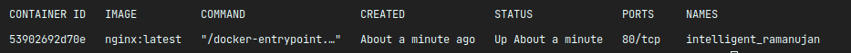

# First Container
When you already pulled an image on your machine, let's run it.

``docker run nginx:latest`` - (docker run image:tag)

When you run ``docker container ls`` (alternatively you can use ``docker ps``) you will see list of your running containers.

You can also run your container in **detached mode** by
``docker run -d nginx:latest``

Detached mode means that your container will work in background, and won't take your terminal busy. 